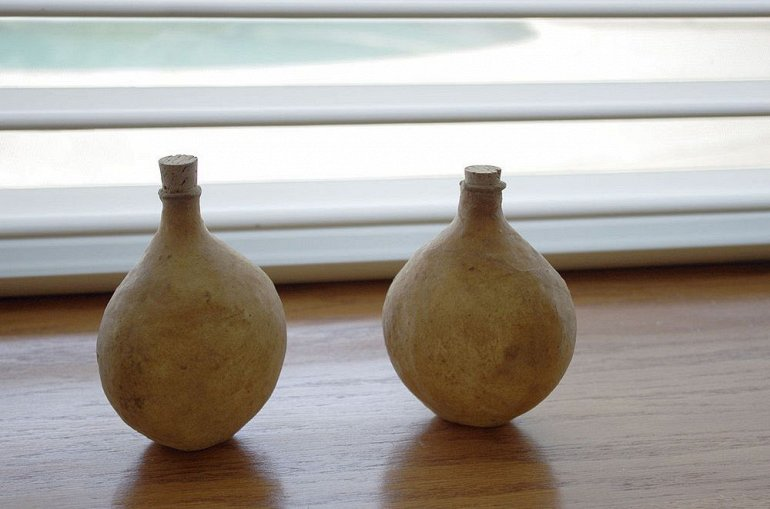

# Indian perfume that smells like rain

Do you love this fresh musky earth scent that soaks up the air when the streams of rain hit the dried up land? It is known as Petricor - a pleasant cocktail of aromatic chemical compounds that are released by plants and bacteria living in the soil. These bacteria make a major contribution to the distinct earth smell. When they die in periods of drought, they release a compound called geosmin to which the human nose is extremely sensitive. But geosmin cannot rise in the air until the first drops of rain fall to the ground and release geosmin molecules from the soil. While researchers are just beginning to understand the chemistry of this wonderful scent, a small town in India's Uttar Pradesh catches this scent in a bottle of perfume.

Cannaugge is located on the bank of the Ganges River, between the cities of Agra and Lucknow. The ancient city has been home to the perfume industry since Harsawardhan, who ruled northern India in the 7th century. Kannaudja spirits were known among the Great Mughal Emperors who ruled India for almost 300 years. Approximately 1300 years later, almost half of the 1.5 million inhabitants of Kannaudja are still engaged in the production of perfumes using traditional methods.

Every morning, local farmers collect various flowers such as rose, jasmine, champagne, lotus, ginger lily, gardenia and dozens of others, and deliver them to more than two hundred perfume factories scattered throughout the city. The flowers are mixed with water and heated in large copper vats. The aromatic steam is then transferred through bamboo pipes to a container containing sandal oil, which acts as a base for perfumes. The perfume is then transferred to bottles made of camel leather, whose porosity allows excess water to evaporate, keeping the fragrance and oil inside.

The most remarkable product in Kannaudja is the mitti Attar, or "perfume of the earth. The process of making mitti Attar is similar to any other aromatic compound, but instead of flower petals, degrees are filled with flat bricks from the dried earth, a drop of water from the nearest pond, and then the vats are sealed with clay. It takes six to seven hours before the whole aroma evaporates from the clay.

No matter how unique the Kannauja offers are, the centuries-old business is slowly losing clients, as the youth of India are increasingly turning to cheaper alcohol-based products. For example, a bottle of Ruh Gulab (pinkattar) for 100 ml costs 1000 rupees - about 14 dollars, but you can get a synthetic flavor of rose for only 100 rupees, or less than 1.50 dollars.

"Most customers prefer modern perfumes and deodorants. If good deodorant can do the same for you, why spend so much on anattaras? " asks Nishish Tevari, the owner of a perfume store in Kannauja.

